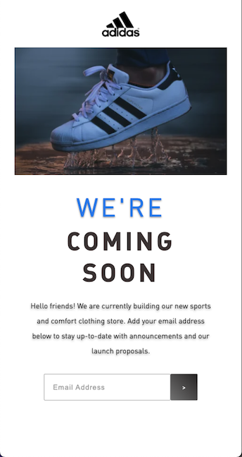

# Coming Soon Page

## Description

This is a mobile responsive project using semantic HTML and CSS flexbox.
It is a mock "Coming Soon" page for a potential client.
First proposition is based on first design provided by client UI/UX team.
Second proposition is based on the feedback from the client.

Click [Here](https://assets.codepen.io/6060109/COMING-SOON.fig) to download Figma Design.

See final webpage [here.](https://irjaimes.github.io/Coming-Soon-Page/)

### Table of Contents

- [Installation](#installation)
- [Images](#images)
- [License](#license)
- [Questions](#questions)

### Installation

Clone repository and open index.html in local server.
No NPM packages dependencies required.

### Images

**First Proposition**

**Second Proposition**

### License

None

<!--  -->

### Questions

For any questions, please feel free to contact me.

- Github Username: [irjaimes](https://github.com/irjaimes/Coming-Soon-Page)
- Email : irjaimes@outlook.com
